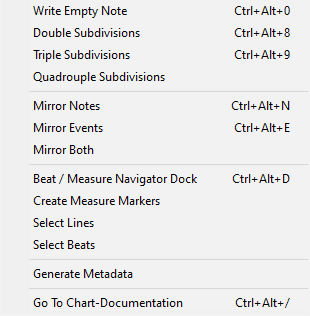

# XDRVTools for Notepad++
XDRVTools is a plugin for Notepad++ that makes directly editing .xdrv files as text easier and more efficient.
Current build is guaranteed to work on Windows systems, not yet tested for Linux or Mac.

## Installation:
1. Go to the "Releases" page of this repository. There, download and unzip the latest version of XDRVTools.
2. Locate the Notepad++ plugins folder. This can be done by selecting "Plugins" → "Open Plugins Folder..." in Notepad++ or by going to your program files and finding the Notepad++ folder.
3. Paste the file `XDRVTools.dll` to Notepad++ `plugins/XDRVTools` folder.
4. Restart Notepad++. The plugin should appear under the "Plugins" menu.
5. Open an XDRV file and start using the suite of commands.

## Planned Changes:
* Rework functions to perform text changes in one action (in order to work better with Undo/Redo commands.)
* Additional changes / features as recommended by users!

## ❗ Important Info:
* For ease of use, XDRVTools will expand your selections to cover all of the contained lines or measures as relevant.
* XDRVTools is only meant to be used with .xdrv files. The behavior of XDRVTools commands on other chart files is unpredictable.
* Caution should be exercised when mirroring hold notes and drifts, as XDRVTools does not automatically mirror unselected note ends / starts.
* Grave markers (`) are used as an indicator for both event mirroring and beat markers. Therefore, it is highly advised that you avoid using grave markers in elements like checkpoints.

## Command List:

1. **Write Empty Note:** Creates an empty note (000-000|00|0) directly at the selection.
2. **Double Subdivisions:** Doubles the subdivisions of all selected beats.
3. **Triple Subdivisions:** Triples the subdivisions of all selected beats.
4. **Quadrouple Subdivisions:** Quadrouples the subdivisions of all selected beats.
---
5. **Mirror Notes:** Mirrors notes horizontally in all selected lines. (Excludes drifts.)
6. **Mirror Events:** Mirrors events in all selected line. (Left → Right, Right → Left)
7. **Mirror Both:** Mirrors both notes and events in the selected lines.
---
8. **Beat / Measure Navigator Dock:** Creates a dock that allows you to easily find a specific beat/measure in the file. (Currently assumes that your song is in 4/4.)
9. **Create Measure Markers:** Creates a special marker for every 4th beat.
10. **Select Lines**: Expands your current selection to cover the entirety of all contained lines.
11. **Select Beats**: Expands your current selection to cover the entirety of all contained beats.
---
12. **Generate Metadata**: Generates blank song metadata with some default values.
---
13. **Go To Chart-Documentation**: Goes to the official Github page for .xdrv documentation.

Special thanks to tari, riley, and all other contributors to EX-XDRiVER for making an incredible game with so much creative potential.
